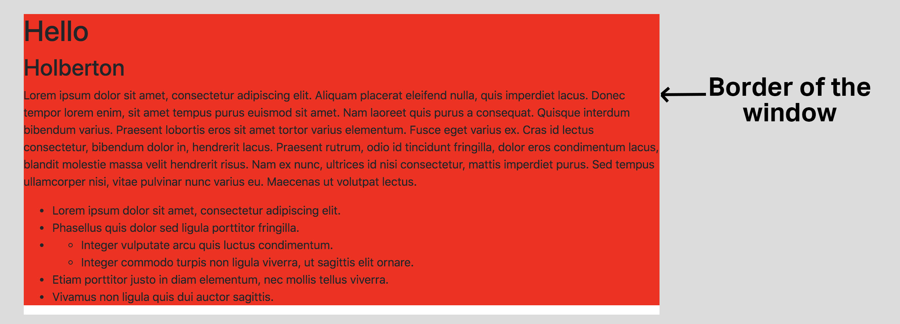

# Bootstrap
In this project we learn the basics of Bootstrap, a free and open-source CSS framework directed at responsive, mobile-first front-end web development.
## Learning Objectives
- Usage of Containers
- Usage of the Grid system
- Usage of Components
- Usage of Utilities
## Tasks
0. Reboot Styling
From this HTML:
    "0-index.html"

    Add Bootstrap to reset the CSS styling.

    Your final page must look like this:

1. 