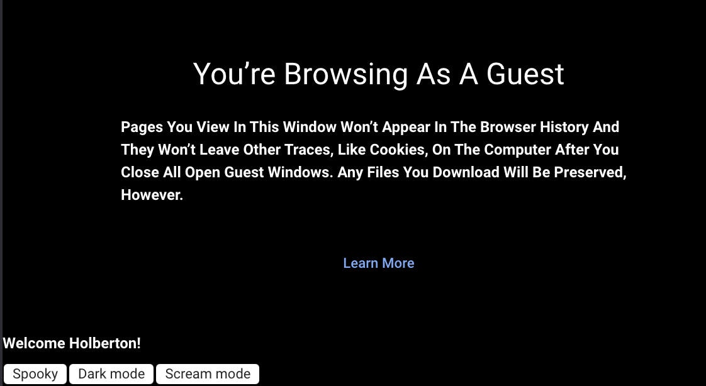

# JavaScript advanced
This project hones in on mastering JavaScript closures for modular and efficient code. Participants learn to chain closures, simulate private methods, and grasp execution stack order, binding, and callbacks. By project completion, a strong foundation in these advanced concepts is established for creating more resilient and maintainable JavaScript code.
## Learning Objectives
- What is lexical scoping in JavaScript
- What is closure in JavaScript
- How to use closure
- How to chain different closures
- How to simulate private methods with Closure
- The execution stack order with JavaScript
- How to use binding
- How to use callbacks
## Tasks
0. [Lexical scoping and welcome message](#Lexical-scoping-and-welcome-message)
1. [Closure Scope Chain](#Closure-Scope-Chain)
2. [Closure](#Closure)
3. [Closure and loops](#Closure-and-loops)
4. [Complex Closure](#Complex-Closure)
5. [Changing DOM with closure](#Changing-DOM-with-closure)
6. [Private methods with closure](#Private-methods-with-closure)
7. [Stack order and setTimeout](#Stack-order-and-setTimeout)
8. [Stack order in functions](#Stack-order-in-functions)
9. [Prime numbers & timing execution](#Prime-numbers-&-timing-execution)

### Lexical scoping and welcome message
Create a function named welcome:
- It takes two arguments: firstName (string) and lastName (string)
- It contains a variable named fullName, that will contains the firstName followed by a space and then the lastName
- Within the welcome function, write a function named displayFullName:
- It should display an alert with the message Welcome + the variable fullName + and exclamation mark.
- Call the function displayFullName at the end of the function welcome

How to test
- Open your web inspector in the tab “Console”
- Copy paste your code
- Run welcome('Holberton', 'School'); should prompt an alert with this content: Welcome Holberton School!
- alert(fullName), should return a reference error fullName is not defined

### Closure Scope Chain
- Create a variable named globalVariable with value Welcome
- Create a function outer that:
    - alerts the content of the variable globalVariable
    - creates a variable named course with value Holberton
    - creates a function inner that:
        - alerts the content of the variable globalVariable and course (concatenated)
        - creates a variable named exclamation with value !
        - creates a function inception that alerts the content of the variable globalVariable, course, and exclamation (concatenated)
        - calls the function inception
    - calls the function inner
- Call the function outer

Compose the code:
- Write the function inception within inner
- Write the function inner within outer
- Call the function outer in the main code (outside any function)
- Call the function inner within outer
- Call the function inception within inner

Requirements:
- Running the script should display three popups one by one with the text Welcome, Welcome Holberton, and Welcome Holberton!

### Closure
Write a function named welcomeMessage:
- It accepts one argument fullName (string)
- It should be a closure for an alert displaying Welcome <fullName>

After this function definition, create three variables:- 
- guillaume contains a call welcomeMessage with Guillaume as argument
- alex contains a call welcomeMessage with Alex as argument
- fred contains a call welcomeMessage with Fred as argument

How to test:
- In your web console, cop/paste your file
- Executing the following in the console:

```javascript
guillaume();
alex();
fred();
```

Should display three alerts like below:


### Closure and loops
Write a function named createClassRoom:
- It takes into argument numbersOfStudents (number)
- Inside, it contains a function studentSeat, that takes into argument seat (number) and returns a function that returns the seat number
- After the definition of studentSeat, create and populate a variable students (array)
    - Using a loop from 0 to numbersOfStudents, pass the number of iteration + 1 to studentSeat and add its return value to the students array
- Returns the students array

Create a closure classRoom, calling createClassRoom with 10 students

Requirements:

Executing the following code:

```javascript
console.log(classRoom[0]());
console.log(classRoom[3]());
console.log(classRoom[9]());
```

Should return:

```javascript
1
4
10
```

### Complex Closure
Create a function divideBy:
- It takes into argument firstNumber (number)
- It returns a function that takes into argument secondNumber (number)
    - It returns the second number divided by the first number

Create a function addBy:
- It takes into argument firstNumber (number)
- It returns a function that takes into argument secondNumber (number)
    - It returns the sum of the two numbers

Create four closures:
- addBy100, that uses the function addBy with the number 100
- addBy1000, that uses the function addBy with the number 1000
- divideBy10, that uses the function divideBy with the number 10
- divideBy100, that uses the function divideBy with the number 100

Requirements:

Executing the following code:

```javascript
console.log(addBy100(20));
console.log(divideBy10(20));
console.log(divideBy100(200));
console.log(addBy1000(20));
```

Should display in the console:

```javascript
120
2
2
1020
```

### Changing DOM with closure
Create a function named changeMode:
It accepts 5 arguments size (number), weight (string), transform (string), background (string), color (string)
Using closure, it changes the style of the entire page and set the font-size, font-weight, text-transform, background-color, and color

Write a function named main:
Set a variable named spooky that passes the arguments 9, bold, uppercase, pink, green to changeMode
Set a variable named darkMode that passes the arguments 12, bold, capitalize, black, white to changeMode
Set a variable named screamMode that passes the arguments 12, normal, lowercase, white, black to changeMode
Add a paragraph to the body of the page with the text Welcome Holberton!
Add a button to the body with the text Spooky
Add a button to the body with the text Dark mode
Add a button to the body with the text Scream mode
When clicking on each button, the page CSS should change to the different themes you created previously

Call the main function

Requirements:
Use vanilla JavaScript to add the elements to the DOM and change the style of the page
JQuery not allowed!

Clicking the Spooky button should change the web page to look something like this:


Clicking the Dark mode button should change the web page to look something like this:



Clicking the Scream mode button should change the web page to look something like this:


### Private methods with closure
Write a module named studentHogwarts:
- It contains two variables privateScore set to 0, and name set to null
- It contains one private method changeScoreBy, it takes points in argument and add it to privateScore
- The module gives access to four public methods (return an object):
    - setName, it takes into argument newName, and set the private variable name
    - rewardStudent, it calls the method changeScoreBy with 1
    - penalizeStudent, it calls the method changeScoreBy with -1
    - getScore, it returns name: score (ex: Harry: 14)

Create one variable named harry, that is an instance of studentHogwarts:
- Set the name of the object to Harry
- Reward the student four times
- Log to the console the name and score

Create one variable named draco, that is an instance of studentHogwarts:
- Sets the name of the object to Draco
- Reward the student one time
- Penalize the student three times
- Log to the console the name and score

Requirements:
Executing the code should display in the console

```javascript
Harry: 4
Draco: -2
```

### Stack order and setTimeout
Write the following commands in the following order:
- Log to the console Start of the execution queue
- Log to the console Final code block to be executed using setTimeout (with delay of 0)
- Using a loop that iterates 100 times, each iteration logs to the console the iteration number
- Log to the console End of the loop printing

Requirements:
- Your code should log to the console the following:

```javascript
Start of the execution queue
1
2
...
100
End of the loop printing
Final code block to be executed
```

### Stack order in functions
- Write a function processPayment:
- It takes one argument amount (number)
- It logs to the console Collecting payment of <amount>

Write a function named processOrder:
- It takes two arguments orderId (number), and amount (number)
- It logs to the console <orderId> is being processed
- It calls the function processPayment
- It logs to the console <orderId> has been fully processed

In the main part of the code:
- Logs to the console Processing orders
- Call processOrder with 12321 and 10.99
- Call processOrder with 12322 and 12.99
- Call processOrder with 12323 and 15.0
- Logs to the console All the orders have been processed

Requirements:
- Your code should log the following to the console:

```javascript
Processing orders
12321 is being processed
Collecting payment of 10.99
12321 has been fully processed
12322 is being processed
Collecting payment of 12.99
12322 has been fully processed
12323 is being processed
Collecting payment of 15
12323 has been fully processed
All the orders have been processed
```

### Prime numbers & timing execution
Write a function named countPrimeNumbers:
- It will return the number of prime numbers from 2 to 100

Log to the console the time in milliseconds to execute the function in this format: Execution time of printing countPrimeNumbers was <time used> milliseconds.

Requirements:
- You must use performance API to measure the time needed to execute the function (performance.now())
- Your code should display something in the range of Execution time of printing countPrimeNumbers was 0.2700000002514571 milliseconds.

### Execution stack & timing execution