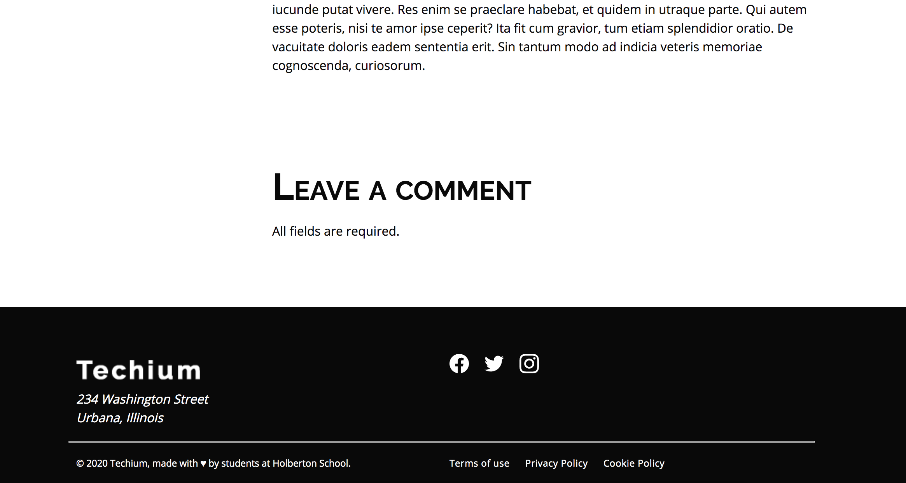

# Accessibility
This project we learn how to create HTML5 forms, select appropriate input types, apply regular expressions for field constraints, style inputs for various states, build comment and search forms, and create usable and accessible forms

## Learning Objectives
- How to create an HTML5 form
- How to choose the right input type
- How to constrain a form field with regular expressions
- How to style inputs for invalid, valid, and required fields
- How to build a a comment form
- How to build a simple search form
- How to create usable and accessible forms

## Task
0. #### Basic comment structure
    To ensure we start on the same foot, use these files:

    00-article.html
    00-styles.css

    Click to expand/hide file contents
    In your 01-article.html file
    - Sibling to the 
, create a new <section> with the class post-comments
    - Inside the section create an header
        - In the <header> create a heading level 2 with class section-title and text: Leave a comment
        - under the level 2 heading create a paragraph with text: All fields are required.
    - Create a form siblings to the header
        - Action: #
        - Method: post
    In your 01-styles.css file
    After the Tag list styles, create a new comment:

    /*** FORM ***/
    /* Comment section
        ============================= */
    
    - Target post-comments class
        - Property: width, Value: 80%
        - Property: margin, Value: 10rem 0 0 auto
        - Property: padding-left, Value: 7rem
    - Target the section-title class inside the post-comments class
        - Property: font-variant, Value: small-caps
    - Add a new comment section:
    /* Basic form
        ============================= */

    - Target all form
        - Property: display, Value: flex
        - Property: flex-direction, Value: column
        - Property: padding, Value: 1rem 0
        - Property: margin, Value: 0
    Final rendering
